<h2 align="center">Hi 👋! My name is Marco</h2>

###

<h3 align="center">A Junior Software Engineer and Computer Science student at University of Palermo</h3>

  

###

<h3 align="center">Projects</h3>

  

  

<h3 align="center">About Me</h3>
<ul>
  <li> 
    
  😸 Core Contributor of [Cheshire Cat](https://cheshirecat.ai/) 
  </li>
  <li>⚡ Electronic and Embedded Enthusiast </li>
</ul>

###

<h3 align="left">Connect with me:</h3>

  

###

<h3 align="left">Languages and Tools:</h3>

###

  
  
  
  
  
  
  
  
  
  
  
  
  
  
  

###

  
  
  
  
  
  
  
  
  
  
  
  
  
  
  
  
  
  
  
  
  

###

###

###
